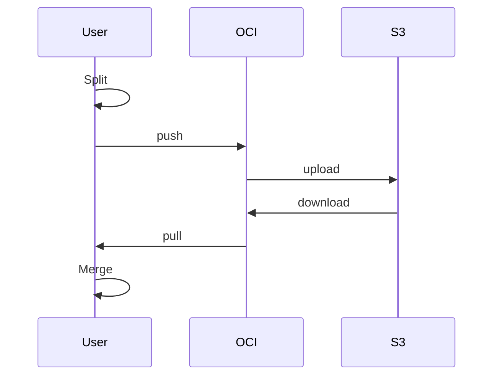
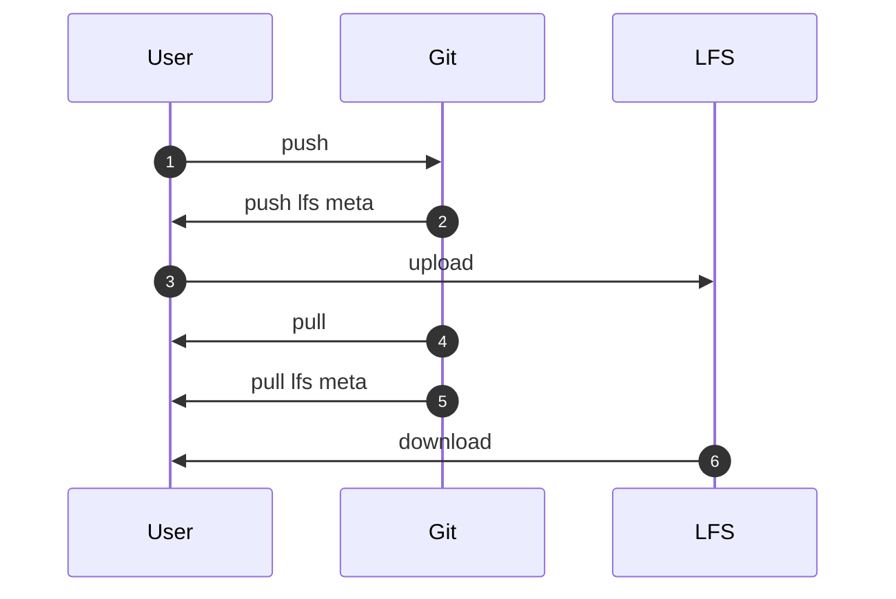
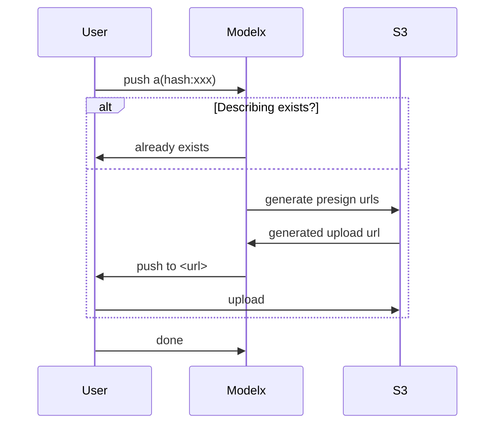
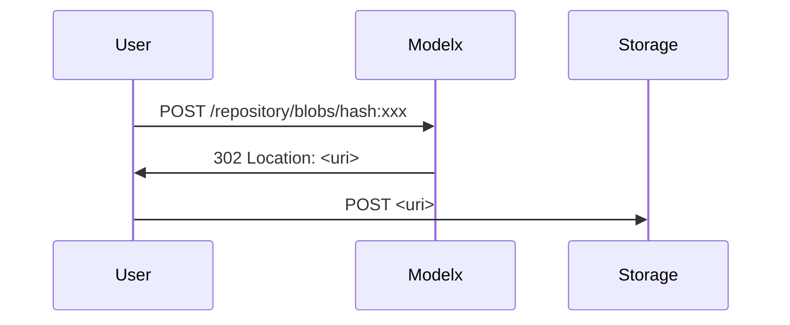

# 为什么要自己设计模型仓库

最近需要寻找一种更友好的方式来存储我们的模型。
我们曾经在使用 ormb 时遇见了问题，由于我们的模型有的非常大（数十 GB），在使用 ormb 时将会面临：

1. ormb push 时，harbor 报错。原因是 harbor 内存超出限制以及 harbor 接入的 s3 有单文件上传大小限制。
2. 每当模型有变动时（即使变动很小），都会重新生成全量的镜像层，在部署时都需要重新拉取数十 GB 的文件。
3. 其他相关问题。

此外，我们还正在开发新的算法商店，需要一个能够和算法商店对接的模型仓库服务，以便于仓库中的模型能够在算法商店中更好的展示。

## 寻找替代

为此，需要寻找新的替代方案。需要能够满足：

- 支持模型readme预览,能查看模型文件列表。
- 可以版本化管理并支持增量。

使用 GIT LFS:

Huggingface 使用了 git + lfs 模型进行模型托管，将小文件以及代码使用 git 进行版本管理，将模型或其他大文件存放至 git lfs。

这种方式增加了一个 git 服务，对于大流量时，git 服务会成为瓶颈。
对于私有化部署，需要引入一个 git server 和对 git servre 的多租户配置，对于我们来说确实不够精简。
而且使用 git 方式，模型数据会在两个地方存放，增加维护成本。

使用对象存储：

一众云厂商的解决方案是将模型存储到了对象存储，华为 ModelArts ，百度 BML，阿里 PAI，腾讯 TI-ONE，Amazon SageMaker 等。
对于公有云来说，提供 ML 解决方案同时将数据都放在对象存储中是最好的方式。

但在私有云中，虽然也用对象存储，但我们没有 ML 的配套方案。若让用户将模型直接存储在对象存储中，将难以进行版本控制。
我们需要提供一套管理机制，放在用户和对象存储之间。

使用OCI registry:

借鉴 ormb 的方式，可以将模型存储在 OCI registry 中。为了解决之前遇到的问题，需要对现有 ormb 的打包流程进行优化，将 big layer 进行拆分，增加文件复用。
这又带来新问题，对于使用者来说，必须要使用修改后的 ormb 才能正常下载模型。

改都改了不如彻底一点，基于 OCI 编写一个新的程序来帮助我们解决这个问题。对，就这么干！

## 从零开始

以 OCI 作为服务端，OCI 服务端后端存储对接到 S3。OCI 仓库不使用 harbor，选择了更轻量的 docker registry v2。
将模型使用合适的方法分层然后 push 到 OCI 仓库，下载时再将模型拉下来合并还原。



非常好，我们的数据经过了 本地->OCI->S3 并存储起来了。但是，如果流量再大一点呢，OCI 或许是新的瓶颈。
那能不能 本地->S3 呢？这样岂不是又快又好了。

上面说到在直接使用对象存储时我们面临的问题为难以进行版本控制，且 s3 的 key 需要分发到客户端，更难以进行权限控制。

这里借鉴 git lfs 提供的思路，将文件直接从 git 直接上传到 git lfs server，而 git server 仅做了协调。



于是一个新的结构产生了：



这个协调者负责沟通用户和 S3，并包含了鉴权等，核心流程为：

1. 用户本地将模型合理打包成多个文件，并计算文件的 hash 准备上传。
2. 检查该 hash 的文件是否存在，若存在即结束，不做操作。
3. 若不存在则 modelx 返回一个临时 url，客户端向该 url 上传。
4. 上传完成后通告 modelx。

这和 git lfs 非常像, git lfs 也有基于 S3 的实现， 但是我们不需要引入一个完整的 git server（带来了额外的复杂度）。

好了，总体思路确定后，开始完善每个流程的细节，这个新的东西称为 **modelx** 。

## modelx

### 数据存储

先解决如何存储数据,先看存储部分 server 端接口：

参考 OCI 我们 server 端仅包含三种核心对象：

| name     | description                            |
| -------- | -------------------------------------- |
| index    | 全局索引，用于寻找所有 manifest        |
| manifest | 版本描述文件，记录版本包含的 blob 文件 |
| blob     | 数据文件，实际存储数据的类型           |

所以一个 manifest 示例为:

```yaml
schemaVersion:
mediaType:
config:
  - name: modelx.yaml
    digest: sha256:xxxxxxxx...
    mediaType: "?"
    size: 45
blobs:
  - name: file-a.bin
    digest: sha256:xxxxxxxx...
    mediaType: ""
    size: 18723
  - name: file-b.bin
    digest: sha256:xxxxxxxx...
    mediaType: "?"
    size: 10086
annotaitons:
  description: "some description"
```

服务端接口：

| method | path                                 | description          |
| ------ | ------------------------------------ | -------------------- |
| GET    | /                                    | 获取全局索引         |
| GET    | /{repository}/{name}/index           | 获取索引             |
| GET    | /{repository}/{name}/manifests/{tag} | 获取特定版本描述文件 |
| DELETE | /{repository}/{name}/manifests/{tag} | 删除特定版本描述文件 |
| HEAD   | /{repository}/{name}/blobs/{digest}  | 判断数据文件是否存在 |
| GET    | /{repository}/{name}/blobs/{digest}  | 获取特定版本数据文件 |
| PUT    | /{repository}/{name}/blobs/{digest}  | 上传特定版本数据文件 |

似曾相识，对，这和 OCI registry 的接口非常像，但是更简单了。

上传流程：

1. 客户端准备本地文件，对每个需要上传的 blob 文件，计算 sha256。生成 manifest。
2. 客户端对每个 blob 文件执行：
   1. 检查服务端是否存在对应 hash 的 blob 文件，如果存在，则跳过。
   2. 否则开始上传，服务端存储 blob 文件。服务端可能存在重定向时遵循重定向。
3. 在每个 blob 均上传完成后，客户端上传 manifest 文件
4. 服务端解析 manifest 文件，更新 index。

> 这里有一个隐形约定：客户端在上传 manifest 之前，确保已经上传了所有 blob。
> 上传 manifest 意味着客户端承诺上传了 manifest 中所有的部分，以便于其他客户端可以发现并能够下载完整的数据。

下载流程：

1. 客户端向服务端查询 index 文件，获取 manifest 文件的地址。
2. 客户端向服务端获取 manifest 文件，并解析 manifest 文件，获取每个 blob 文件的地址。
3. 客户端对每个 blob 文件执行：
   1. 检查本地文件是否存在，如果存在，判断 hash 是否相等，若相等则认为本地文件于远端相同无需更新。
   2. 若不存在或者 hash 不同，则下载该文件覆盖本地文件。

我们实现了一个简单的文件服务器，这对我们来说已经可以用了。

### 负载分离

这就是一个简单的文件服务器，数据还是流过了 modelx， 那如何实现直接本地直接上传到 S3 流程呢？

这里借助了 302 状态码，当客户端上传 blob 时，可能收到 302 响应，
此时 Location Header 会包含重定向的 URI，客户端需要重新将 blob 上传至该地址。下载时也使用相同逻辑。

在使用S3作为存储后端时，我们使用到了s3 presign urls，能够对特定object生成临时 url 来上传和下载，这非常关键。



为了支持非 http 协议存储，客户端需要在收到 302 响应后根据具体地址使用不同的方式处理上传。

- 对于 http ，会收到以 `http(s)://` 开头的重定向地址，此时客户端继续使用 http 协议上传至该地址。
- 对于 S3，可能收到以 `s3://` 开头的 presign 的 S3 地址，则此时则需要客户端转为使用 s3 client 上传 blob 到该地址。
- 此外，服务端还可以响应其他协议的地址，客户端可以自行实现并扩展到其他存储协议。

**这基本上是一个简单高效的，可索引的，版本化的文件存储服务。不仅可以用于存储模型，甚至可以推广到存储镜像，charts 等。**

## 为什么不用OCI？

我们在研究了OCI destribution 的协议后，发现OCI协议在上传接口上无法做到能够让客户端直接与存储服务器交互。
总是需要在最终的存储服务器前增加一个适应层。
详细的可以参看 OCI [Distribution Specification](https://github.com/opencontainers/distribution-spec/blob/main/spec.md#post-then-put)。

OCI 中无法获得模型文件列表，从而无法仅下载指定文件。

### 模型存储

在已有的服务端实现中，可以看到 modelx 服务端仅负责文件存储，对于 manifest 中实际包含哪些 blob，还是由客户端决定。

我们的最终目的是用于存储模型，面临的模型可能有超大单文件以及海量小文件的场景。
除了解决如何将模型存储起来，还需要解决如何管理多个模型版本，模型下载（增量下载）。

在上一节的 manifest 中，每一个 blob 都包含了 mediaType 字段，以表示该文件的类型。可以从这里进行扩展。

- 对于单个大文件，可以不用特殊处理，客户端会在上传和下载时使用 s3 client 分块处理。
- 对于海量小文件，选择在客户端将小文件打包压缩为单文件，设置特别的 mediaType 进行上传；在下载时，对特别的 mediaType 进行解包还原。
- 对于增量，类似于OCI image，客户端会在本地计算更改的文件，客户端仅用上传改变的文件。在下载时，客户端也会仅下载与远程对比 hash 不同的文件。
- 对于部署，部署时可能仅需要下载某一个文件，则可以借助 modelx.yaml,在其中指定仅需要在部署时下载的模型文件。
  同时 modelx.yaml 还包含了 model-serving 时所需要的一些信息。

一个 modelx.yaml 示例(非最终版)：

```yaml
config:
  inputs: {}
  outputs: {}
description: Awesome text generator
framework: pytorch
maintainers:
  - maintainer
tags:
  - modelx
  - demo
task: text-generation
modelFiles:
  - torch.bin
  - tf_output.h5
```

### 认证授权

有了上面的实现，认证可以插入到服务端几个接口中，对请求进行拦截。

目前modelx实现了基于 OIDC 的认证方案，modelx 仅需要填写一个外部 OIDC Identity Provider 地址即可使用。

## 总结

最终来说，我们实现了一个简单的、 高性能的、可扩展的模型存储服务。
结合了 OCI、git-lfs 和 对象存储的优势，并解决了我们在模型管理遇到的问题。
未来 modelx 依旧还有许多事情要做，欢迎大家参与到 modelx 以及 kubegems 社区中来。

如果你想快速体验一下 modelx 可以看看[Setup](setup.md).
